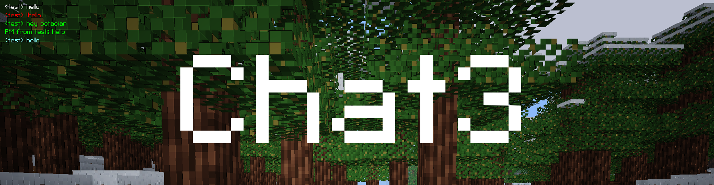

Enhanced Chat [chat3]
=======================
- GitHub: https://github.com/octacian/chat3
- Download: https://github.com/octacian/chat3/archive/master.zip
- Forum: https://forum.minetest.net/viewtopic.php?t=17163

**Notice:** chat3 requires that the server be running Minetest 0.4.16, as it is required for several features of chat3's core functionality. More specifically, you need a version of Minetest that includes [this commit](https://github.com/minetest/minetest/commit/43d1f375d18a2fbc547a9b4f23d1354d645856ca) (May 6th, 2017).

Yes, chat3 seems a whole lot like a spinoff of chat2, however, it (mostly) isn't. It isn't that much unlike chat3, except for one thing: rather than cluttering the screen with a second chat window, chat3 just uses the default Minetest chat. Then it's entirely up to the player to configure the chat placement, size, and anything else on their client.

Messages are highlighted in a light blue to players who are within 12 blocks of the sender (configurable with `chat3.near`, if set to `0` positional highlighting is ignored). Messages in which the receiving player's name or a previously configured alternate username is mentioned are highlighted in a light green, as are PMs. Messages in which the first character is a `!` are highlighted in red to all players (also known as a shout). Important messages (mentions or shouts) also cause a bell to be played to players if `chat3.bell` is `true` and the player hasn't disabled the chatbell using the `/chatbell` command. Everything mentioned here can also be configured, and is documented below in the Configuration section.

If the server is using Minetest 0.4.16, which has the ability to properly retreive the protocol version of the client without requiring a debug build, chat3 will automatically adjust its message handling to work with older clients as well. This means that clients before 0.4.16 will not see chat duplication on their side, and colour codes will not be sent to clients that do not support them.

Chat3 is also compatible with some of my other chat-related mods, including [ranks](https://forum.minetest.net/viewtopic.php?f=9&t=17640).

Configuration
-------------

All of the features provided by chat3 can be configured directly from the advanced settings menu in the chat3 subsection of the top-level Mods section. You can also configure chat3 directly from `minetest.conf` with the settings listed below.

| Name               | Type   | Default | Description               |
| ------------------ | ------ | ------- | ------------------------- |
| chat3.near         | float  | 12      | Near highlight range      |
| chat3.bell         | bool   | true    | Enable chatbell           |
| chat3.shout        | bool   | true    | Allow shout messages      |
| chat3.shout_prefix | string | !       | Shout prefix              |
| chat3.ignore       | bool   | true    | Allow ignoring players    |
| chat3.alt_support  | bool   | true    | Allow alternate usernames |
| chat3.alt_max      | int    | 3       | Maximum # of alts         |

The chatbell can also be enabled or disabled using the `/chatbell` command per-player. The ignore feature can be further configured by adding players that cannot be ignored with `ignore_override` privilege. Furthermore, the server owner (as defined by the `name` setting) cannot be ignored no matter what.

Media License
-------------

Brandon75689 - https://opengameart.org/content/point-bell (CC-BY-SA 3.0)
	chat3_bell.ogg
